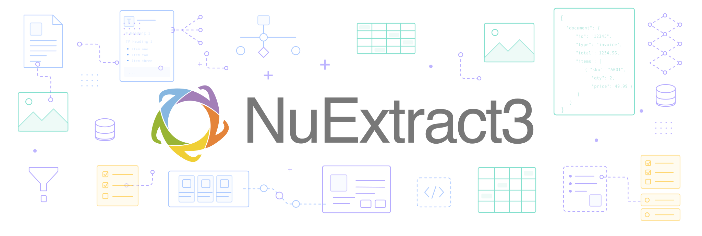
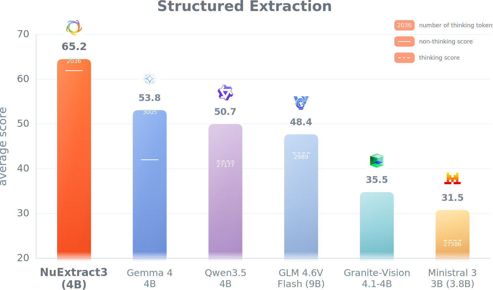
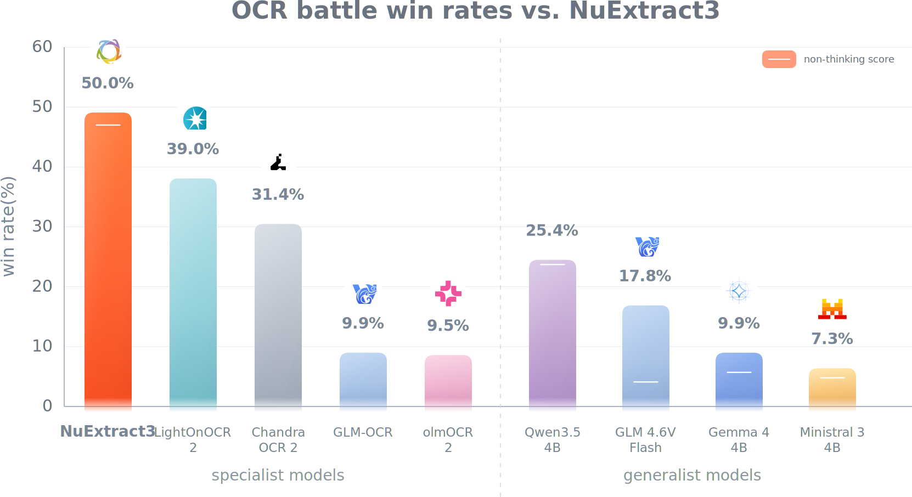
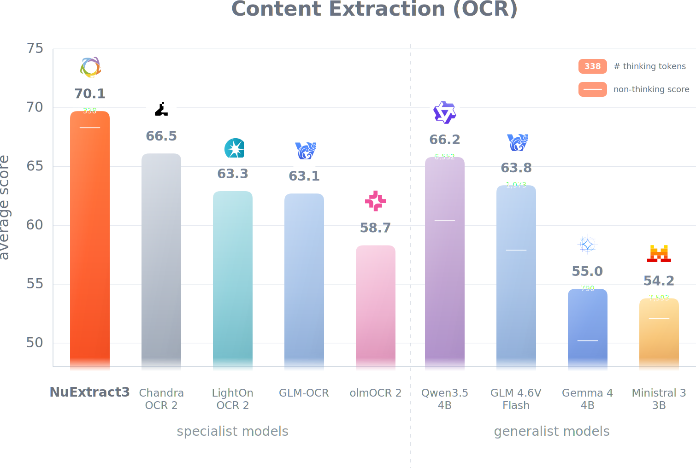

<p align="center">
    <a href="https://nuextract.ai/">
        
    </a>
</p>


<p align="center">
        🖥️ <a href="https://nuextract.ai/">API / Platform</a>&nbsp;&nbsp; | &nbsp;&nbsp;
        📑 <a href="https://numind.ai/blog">Blog</a>&nbsp;&nbsp; | &nbsp;&nbsp;
        🗣️ <a href="https://discord.gg/3tsEtJNCDe">Discord</a>&nbsp;&nbsp; | &nbsp;&nbsp;
        🛠️ <a href="https://github.com/numindai/nuextract">GitHub</a>
</p>

**NuExtract3** is a unified **4B** vision-language reasoning model for document understanding.

It combines strong **structured information extraction** with high-quality **image-to-Markdown** conversion, making it suitable for extraction pipelines, OCR, and RAG preprocessing for all types of documents such as scans, receipts, forms, invoices, contracts or tables.

Try it out in [the 🤗 space!](https://huggingface.co/spaces/numind/NuExtract-3-4B)

## Overview

- **Structured extraction**: input (text/images) + JSON template + instructions --> JSON output
- **Markdown conversion**: input (text/images) --> Markdown
- **Multimodal inputs**: text, images, or text + images.
- **Multilingual** documents.
- **Reasoning** and non-reasoning inference modes.
- **Template generation** for structured extraction from natural language or input document.

# Benchmark results

## Structured Extraction

We benchmarked NuExtract on NuMind's internal structured benchmark, measuring model's performances on ~600 documents of diverse types including invoices, movie posters or floor plans. These documents and their ground-truth cover diverse use-cases testing model visual understanding, OCR, reasoning and ability to handle long input and output contexts.
We plan to open-source this benchmark in the coming weeks, along with a extensive leaderboard including most popular open-weight and closed-sourced APIs and a Python library allowing to easily measure model performances on structured extraction.



To measure a pair of predicted and ground-truth JSONs, we represent both as trees which we align based on node names, compute metric scores for aligned leaves and report the average of these scores. `string` and `verbatim-string` leaves are evaluated with indel distance (i.e. Levenshtein without replacement), while all others are evaluated with exact-match.
Models were evaluated using vllm, with a temperature of 0.25 and a maximum of 65000 output token (for both thinking and answer), which largely exceeds 22000 which is the number of tokens of the largest ground truth output.

<figure>

|Model name          |Average score|Num. failed⁽¹⁾|Avg. num tokens thinking|Avg. num tokens answer|
|--------------------|-------------|-----------|------------------------|----------------------|
|NuExtract3.4_4B-RL  |**0.651 ± 0.019**|27     |2036                    |1856                  |
|gemma-4-E4B-it      |0.538 ± 0.023|31         |3005                    |1287                  |
|Qwen3.5-9B          |0.479 ± 0.030|170        |22409                   |1257                  |
|Qwen3.5-4B          |0.417 ± 0.031|229        |27177                   |1201                  |
|GLM-4.6V-Flash      |0.435 ± 0.026|153        |2989                    |1357                  |
|Nemotron-3-Nano-Omni|0.387 ± 0.028|204        |25827                   |522                   |
|Ministral-3-3B      |0.240 ± 0.022|344        |27586                   |362                   |

<figcaption>
<small>
(1) number of model outputs that were not JSON deserializable, either directly or by removing leading and trailing backticks.<br>
95% confidence intervals computed using a nonparametric bootstrap over scores distributions.
</small>
</figcaption>
</figure>

The benchmark include samples containing multiple images resulting in large input context, and some with ground-truth containing large numbers of items to extract resulting in large outputs. We found that the reasoning of small models significantly negatively impact their performances. The reason is that many models ended up falling in repetition loops, hitting the output tokens limit and resulting in failed requests.

## Document to Markdown

NuExtract can also convert document images into clean Markdown. Output will be Markdown for text (headers etc), HTML for tables, LaTeX for math and ```<figure data-type="image" data-id="img_n"> ```

Modern, format-agnostic benchmarks for complex document understanding are limited, so we explored a new evaluation approach.
We selected 100 documents with challenging layouts and tables, asked each model to convert them into a structured representation, then used Gemini 3 Flash to compare model outputs against the source document and choose the most accurate result.
The rankings aligned with human votes, suggesting this is a promising method for evaluating document-to-Markdown capabilities. More details will be shared in an upcoming technical report.
Here are some results:



### Using "Markdown-to-structured"

To add other evaluate references, we used our structured extraction benchmark to evaluate models in a two-step fashion: convert the benchmark inputs to Markdown, then use Qwen3.6 27B to perform the structured extraction task on them. Intuitively, it allows to evaluate how models achieve to keep the input document content and layout: good models will allow the "structured extractor" model to perform better scores.



#### No thinking

| Model                | Average score | Avg. num tokens answer |
| ---------------------| ------------: | ---------------------: |
| *Generalist models*  |               |                        |
| NuExtract3           |**0.683 ± 0.021**|1821                  |
| Qwen3.5-4B           |0.604 ± 0.025  |1797                    |
| gemma-4-E4B          |0.502 ± 0.027  |613                     |
| GLM-4.6V-Flash       |0.579 ± 0.029  |928                     |
| Nemotron-3-Nano-Omni |0.640 ± 0.024  |1382                    |
| granite-vision-4.1-4b|0.468 ± 0.026  |750                     |
| Ministral-3-3B       |0.521 ± 0.025  |3248                    |
| *Specialized OCR/Markdown models* |  |                        |
| GLM-OCR              |0.631 ± 0.024  |1247                    |
| LightOnOCR-2-1B      |0.633 ± 0.024  |1073                    |
| olmOCR-2-7B-1025     |0.587 ± 0.024  |732                     |
| chandra-ocr-2        |0.665 ± 0.021  |2012                    |
| PaddleOCR-VL-1.5     |0.433 ± 0.025  |747                     |

#### Thinking
| Model                |     Average score | Avg. num tokens thinking | Avg. num tokens answer |
| -------------------- | ----------------: | -----------------------: | ---------------------: |
| NuExtract3           | **0.701 ± 0.019** |                      338 |                   1981 |
| Qwen3.5-4B           |     0.662 ± 0.022 |                     6552 |                   1547 |
| gemma-4-E4B-it       |     0.550 ± 0.023 |                      790 |                    672 |
| GLM-4.6V-Flash       |     0.638 ± 0.023 |                     1973 |                    886 |
| Nemotron-3-Nano-Omni |     0.626 ± 0.025 |                    11725 |                   1040 |
| Ministral-3-3B       |     0.542 ± 0.026 |                     7593 |                     773|


# Using NuExtract

## Structured extraction

Structured extraction takes as inputs:

1. An input document, which can be text, image, or both;
2. A JSON template describing the information to extract;
3. (Optional) Instructions, allowing to specify expected output formats or values, to provide with the `instructions` chat template kwarg;
4. (Optional) In-Context Learning (ICL) examples.

### Input JSON template

NuExtract uses a input JSON template whose structure is identical to the output JSON. Its leaf values are specify the **types** of the output JSON leaves. For examples:

```json
{
  "invoice_number": "verbatim-string",
  "invoice_date": "date",
  "total_amount": "number",
  "currency": "currency",
  "line_items": [
    {
      "description": "verbatim-string",
      "item_type": ["electronics", "clothing", "vehicle", "furniture", "other"],
      "quantity": "integer",
      "unit_price": "number",
      "total": "number"
    }
  ]
}
```

Supported template types include:

- `verbatim-string`: extract text exactly as it appears in the document;
- `string`: generic string field, allowing abstraction or light paraphrasing;
- `integer`: whole number;
- `number`: integer or decimal number;
- `date-time`: ISO-8601 date, time or date-time;
- Other specific types such as `data`, `time`, `country`, `currency`, `email` and so on.
[**For more details, read the complete types specifications and examples**](assets/TYPES.md)

Template constructors:

- Arrays, for example `["string"]`;
- Enums, for example `["yes", "no", "maybe"]`;
- Multi-enums (multiple possible values), for example `[["A", "B", "C"]]`.

If the model does not find relevant information for a field, it returns `null` or `[]`.

### Converting JSON schema / Pydantic models to NuExtract template

Our Python SDK (`pip install numind`) offers a method to convert JSON schemas to NuExtract templates:

```Python
from typing import Literal

from pydantic import Field, BaseModel
from numind.nuextract_utils import convert_json_schema_to_nuextract_template


class HotelBooking(BaseModel):
    city: str
    check_in_date: str = Field(description="date")
    check_out_date: str = Field(description="date")
    number_of_guests: int
    room_type: Literal["single", "double", "suite"]


template, dropped_branches = convert_json_schema_to_nuextract_template(
    HotelBooking.model_json_schema()
)

# {'check_in_date': 'date', 'check_out_date': 'date', 'city': 'string', 'number_of_guests': 'integer', 'room_type': ['single', 'double', 'suite']}
```

## Document-to-Markdown

NuExtract can also convert document images into clean Markdown. Output will be markdown for text (headers etc), html for tables, latex for mat and ```<figure data-type="image" data-id="img_n"> ```

Markdown example:

```markdown
<figure data-type="image" data-id="img_1">
  
</figure>

# COMMANDE
**NUMÉRO 72259**

1

**Vendu à**
TREMBLAY ERIC
ERIC TREMBLAY
348 BOUL. DE L'ANSE
ROBERVAL
G8H 1Y9

**Livré à**
TREMBLAY ERIC
ERIC TREMBLAY
348 BOUL. DE L'ANSE
ROBERVAL
G8H 1Y9

<table>
  <thead>
    <tr>
      <th># CLIENT</th>
      <th>EXPÉDITEUR</th>
      <th>TERME DE CRÉDIT</th>
      <th>DATE</th>
    </tr>
  </thead>
  <tbody>
    <tr>
      <td>2753133</td>
      <td>Notre camion</td>
      <td>à la livraison</td>
      <td>22/06/2023</td>
    </tr>
  </tbody>
</table>

<table>
  <thead>
    <tr>
      <th>NOM DU VENDEUR</th>
      <th>VOTRE ÉCONOMIE !</th>
      <th># COMMANDE</th>
    </tr>
  </thead>
  <tbody>
    <tr>
      <td>Éric</td>
      <td>0.00</td>
      <td></td>
    </tr>
  </tbody>
</table>
```

---

## Reasoning and non-reasoning modes

NuExtract supports both reasoning and non-reasoning inference.

### Non-thinking mode

Use this for fast and deterministic extraction or Markdown conversion.

```python
enable_thinking = False
temperature = 0.2
```

### Thinking mode

Use this for difficult documents, complex layouts, ambiguous fields, or cases where the document structure requires additional reasoning.

```python
enable_thinking = True
temperature = 0.6
```

For production extraction workloads, we recommend starting with **non-reasoning mode** and enabling reasoning only for difficult examples.


---

## vLLM deployment

NuExtract can be served with vLLM using an OpenAI-compatible API.

```bash
vllm serve numind/NuExtract3 \
  --trust-remote-code \
  --limit-mm-per-prompt '{"image": 99, "video": 0}' \
  --chat-template-content-format openai \
  --generation-config vllm \
  --max-model-len 131072 \
  --speculative-config '{"method": "qwen3_next_mtp", "num_speculative_tokens": 2}'
```


### Multi Token Prediction
<details>
The deployment commands above enable Multi Token Prediction (MTP) through vLLM speculative decoding:

```bash
--speculative-config '{"method": "qwen3_next_mtp", "num_speculative_tokens": 2}'
```

MTP can improve decoding throughput without changing the OpenAI-compatible request payload. You can tune `num_speculative_tokens` for your hardware and workload, or remove `--speculative-config` if your vLLM version or environment does not support this speculative decoding method.

If you encounter memory issues, reduce the maximum model length and the maximum number of images:

```bash
vllm serve numind/NuExtract-3 \
  --trust-remote-code \
  --limit-mm-per-prompt '{"image": 6, "video": 0}' \
  --chat-template-content-format openai \
  --generation-config vllm \
  --max-model-len 16384 \
  --speculative-config '{"method": "qwen3_next_mtp", "num_speculative_tokens": 2}'
```
</details>

## vLLM inference: structured extraction: text
```python
import json
from openai import OpenAI

client = OpenAI(
    api_key="EMPTY",
    base_url="http://localhost:8000/v1",
)

template = {
    "store": "verbatim-string",
    "date": "date-time",
    "total": "number",
    "currency": ["USD", "EUR", "GBP", "JPY", "Other"],
    "items": [
        {
            "name": "verbatim-string",
            "price": "number"
        }
    ]
}

response = client.chat.completions.create(
    model="numind/NuExtract3",
    temperature=0.2,
    messages=[
        {
            "role": "user",
            "content": [
                {
                    "type": "text",
                    "text": "Yesterday I bought apples and coffee at Trader Joe's for a total of $12.40."
                }
            ],
        }
    ],
    extra_body={
        "chat_template_kwargs": {
            "template": json.dumps(template),
            "instructions": "Specify the time for the `date` entry only if it is present, otherwise only output the date component.",
            "enable_thinking": False
        }
    }
)

print(response.choices[0].message.content)
```

Example output:

```json
{
  "store": "Trader Joe's",
  "date": null,
  "total": 12.40,
  "currency": "USD",
  "items": [
    {
      "name": "apples",
      "price": null
    },
    {
      "name": "coffee",
      "price": null
    }
  ]
}
```

---

## vLLM inference: structured extraction: image

```python
import json
import base64
from openai import OpenAI

client = OpenAI(
    api_key="EMPTY",
    base_url="http://localhost:8000/v1",
)

def encode_image(image_path):
    with open(image_path, "rb") as image_file:
        return base64.b64encode(image_file.read()).decode("utf-8")

image_base64 = encode_image("receipt.png")
data_url = f"data:image/png;base64,{image_base64}"

template = {
    "store": "verbatim-string",
    "date": "date-time",
    "total": "number",
    "payment_method": "verbatim-string"
}

response = client.chat.completions.create(
    model="numind/NuExtract3",
    temperature=0.2,
    messages=[
        {
            "role": "user",
            "content": [
                {
                    "type": "image_url",
                    "image_url": {"url": data_url}
                }
            ],
        }
    ],
    extra_body={
        "chat_template_kwargs": {
            "template": json.dumps(template, indent=4),
            "enable_thinking": False
        }
    }
)

print(response.choices[0].message.content)
```

Example output:

```json
{
  "store": "Trader Joe's",
  "date": "2025-04-12",
  "total": 42.85,
  "payment_method": "Visa"
}
```

### Multiple page PDF
<details>
You can render a PDF to one PNG image per page with PyMuPDF, then pass the images to vLLM in page order.

```python
import base64
import json

import fitz  # pip install pymupdf
from openai import OpenAI

client = OpenAI(
    api_key="EMPTY",
    base_url="http://localhost:8000/v1",
)

def pdf_to_png_data_urls(pdf_path, dpi=170):
    data_urls = []

    with fitz.open(pdf_path) as doc:
        for page in doc:
            pix = page.get_pixmap(dpi=dpi, alpha=False)
            png_bytes = pix.tobytes("png")
            png_base64 = base64.b64encode(png_bytes).decode("utf-8")
            data_urls.append(f"data:image/png;base64,{png_base64}")

    return data_urls

data_urls = pdf_to_png_data_urls("invoice.pdf", dpi=170)

template = {
    "invoice_number": "verbatim-string",
    "invoice_date": "date",
    "total": "number",
    "currency": "currency",
    "line_items": [
        {
            "description": "verbatim-string",
            "quantity": "number",
            "unit_price": "number",
            "total": "number"
        }
    ]
}

response = client.chat.completions.create(
    model="numind/NuExtract3",
    temperature=0.2,
    messages=[
        {
            "role": "user",
            "content": [
                {
                    "type": "image_url",
                    "image_url": {"url": data_url}
                }
                for data_url in data_urls
            ],
        }
    ],
    extra_body={
        "chat_template_kwargs": {
            "template": json.dumps(template, indent=4),
            "enable_thinking": False
        }
    }
)

print(response.choices[0].message.content)
```
</details>


## vLLM inference: document-to-Markdown

For Markdown OCR, use `mode="markdown"` or `mode="content"` without a template.

```python
import base64
from openai import OpenAI

client = OpenAI(
    api_key="EMPTY",
    base_url="http://localhost:8000/v1",
)

def encode_image(image_path):
    with open(image_path, "rb") as image_file:
        return base64.b64encode(image_file.read()).decode("utf-8")

image_base64 = encode_image("document.png")
data_url = f"data:image/png;base64,{image_base64}"

response = client.chat.completions.create(
    model="numind/NuExtract3",
    temperature=0,
    messages=[
        {
            "role": "user",
            "content": [
                {
                    "type": "image_url",
                    "image_url": {"url": data_url}
                }
            ],
        }
    ],
    extra_body={
        "chat_template_kwargs": {
            "mode": "markdown",
            "enable_thinking": False
        }
    }
)

print(response.choices[0].message.content)
```

---

## vLLM inference: reasoning mode
<details>
Reasoning can be enabled for harder structured extraction or Markdown tasks.

```python
response = client.chat.completions.create(
    model="numind/NuExtract3",
    temperature=0.7,
    messages=[
        {
            "role": "user",
            "content": [
                {
                    "type": "image_url",
                    "image_url": {"url": data_url}
                }
            ],
        }
    ],
    extra_body={
        "chat_template_kwargs": {
            "mode": "markdown",
            "enable_thinking": True
        }
    }
)

result = response.choices[0].message.content

if "</think>" in result:
    reasoning = result.split("<think>")[1].split("</think>")[0]
    answer = result.split("</think>")[-1].strip()
else:
    reasoning = None
    answer = result

print(answer)
```
</details>


## In-context examples for extraction
<details>
NuExtract supports in-context examples for structured extraction.

Examples are especially useful when the desired formatting is ambiguous or when the schema requires task-specific conventions. Examples can be provided by using `developer` messages, for which all items of the contents except the last one are the input, and the last one is the expected output.

```python
import json
from openai import OpenAI

client = OpenAI(
    api_key="EMPTY",
    base_url="http://localhost:8000/v1",
)

template = {
    "names": ["string"]
}

response = client.chat.completions.create(
    model="numind/NuExtract3",
    temperature=0,
    messages=[
        {
            "role": "developer",
            "content": [
                {
                    "type": "text",
                    "text": "Stephen is the manager at Susan's store.",
                },
                {
                    "type": "text",
                    "text": "{\"names\": [\"-STEPHEN-\", \"-SUSAN-\"]}",
                }
            ],
        },
        {
            "role": "user",
            "content": [
                {
                    "type": "text",
                    "text": "John went to the restaurant with Mary. James went to the cinema."
                }
            ],
        }
    ],
    extra_body={
        "chat_template_kwargs": {
            "template": json.dumps(template, indent=4),
            "enable_thinking": False
        }
    }
)

print(response.choices[0].message.content)
```

Example output:

```json
{
  "names": ["-JOHN-", "-MARY-", "-JAMES-"]
}
```
</details>


## vLLM inference: template generation

NuExtract can generate an extraction template from a natural language description.

```python
from openai import OpenAI

client = OpenAI(
    api_key="EMPTY",
    base_url="http://localhost:8000/v1",
)

response = client.chat.completions.create(
    model="numind/NuExtract3",
    temperature=0,
    messages=[
        {
            "role": "user",
            "content": [
                {
                    "type": "text",
                    "text": "I want to extract the key details from a rental contract."
                }
            ],
        }
    ],
    extra_body={
        "chat_template_kwargs": {
            "mode": "template-generation"
        }
    }
)

print(response.choices[0].message.content)
```

Example output:

```json
{
  "contract_title": "verbatim-string",
  "landlord": "verbatim-string",
  "tenant": "verbatim-string",
  "property_address": "verbatim-string",
  "start_date": "date-time",
  "end_date": "date-time",
  "monthly_rent": "number",
  "currency": "verbatim-string",
  "deposit": "number",
  "signatories": ["verbatim-string"]
}
```

## Curl examples
<details>

The following examples assume that vLLM is running locally on port 8000. They use `jq` to build valid JSON request bodies without manually escaping the image data or template string.

### Single image structured extraction

```bash
API_KEY="EMPTY"
IMAGE_BASE64_FILE=$(mktemp)
REQUEST_BODY_FILE=$(mktemp)

base64 < receipt.png | tr -d '\n' > "$IMAGE_BASE64_FILE"

TEMPLATE=$(cat <<'JSON'
{
  "store": "verbatim-string",
  "date": "date-time",
  "total": "number",
  "payment_method": "verbatim-string"
}
JSON
)

jq -n \
  --rawfile image_base64 "$IMAGE_BASE64_FILE" \
  --arg template "$TEMPLATE" \
  '{
    model: "numind/NuExtract3",
    temperature: 0,
    messages: [
      {
        role: "user",
        content: [
          {
            type: "image_url",
            image_url: {url: ("data:image/png;base64," + $image_base64)}
          }
        ]
      }
    ],
    chat_template_kwargs: {
      template: $template,
      enable_thinking: false
    }
  }' > "$REQUEST_BODY_FILE"

curl http://localhost:8000/v1/chat/completions \
  -H "Content-Type: application/json" \
  -H "Authorization: Bearer $API_KEY" \
  --data-binary "@$REQUEST_BODY_FILE"

rm "$IMAGE_BASE64_FILE" "$REQUEST_BODY_FILE"
```

### Single image content extraction

```bash
API_KEY="EMPTY"
IMAGE_BASE64_FILE=$(mktemp)
REQUEST_BODY_FILE=$(mktemp)

base64 < document.png | tr -d '\n' > "$IMAGE_BASE64_FILE"

jq -n \
  --rawfile image_base64 "$IMAGE_BASE64_FILE" \
  '{
    model: "numind/NuExtract3",
    temperature: 0,
    messages: [
      {
        role: "user",
        content: [
          {
            type: "image_url",
            image_url: {url: ("data:image/png;base64," + $image_base64)}
          }
        ]
      }
    ],
    chat_template_kwargs: {
      mode: "content",
      enable_thinking: false
    }
  }' > "$REQUEST_BODY_FILE"

curl http://localhost:8000/v1/chat/completions \
  -H "Content-Type: application/json" \
  -H "Authorization: Bearer $API_KEY" \
  --data-binary "@$REQUEST_BODY_FILE"

rm "$IMAGE_BASE64_FILE" "$REQUEST_BODY_FILE"
```
</details>


## Transformers example
<details>
You can also run NuExtract directly with `transformers`. The same `template`, `mode`, and `enable_thinking` options are passed to `processor.apply_chat_template`.

```python
import json

import torch
from PIL import Image
from transformers import AutoModelForImageTextToText, AutoProcessor

model_id = "numind/NuExtract3"

processor = AutoProcessor.from_pretrained(
    model_id,
    trust_remote_code=True,
)
model = AutoModelForImageTextToText.from_pretrained(
    model_id,
    dtype=torch.bfloat16,
    device_map="auto",
    trust_remote_code=True,
).eval()

def run_nuextract(messages, **chat_template_kwargs):
    inputs = processor.apply_chat_template(
        messages,
        add_generation_prompt=True,
        tokenize=True,
        return_dict=True,
        return_tensors="pt",
        **chat_template_kwargs,
    ).to(model.device)

    with torch.inference_mode():
        generated_ids = model.generate(
            **inputs,
            max_new_tokens=4096,
            do_sample=False,
        )

    generated_ids = generated_ids[:, inputs.input_ids.shape[1]:]
    return processor.batch_decode(
        generated_ids,
        skip_special_tokens=True,
        clean_up_tokenization_spaces=False,
    )[0].strip()

# Single image structured extraction
receipt_image = Image.open("receipt.png").convert("RGB")
receipt_messages = [
    {
        "role": "user",
        "content": [
            {
                "type": "image",
                "image": receipt_image,
            }
        ],
    }
]

template = {
    "store": "verbatim-string",
    "date": "date-time",
    "total": "number",
    "payment_method": "verbatim-string"
}

structured_output = run_nuextract(
    receipt_messages,
    template=json.dumps(template, indent=4),
    enable_thinking=False,
)
print(structured_output)

# Single image content extraction
document_image = Image.open("document.png").convert("RGB")
document_messages = [
    {
        "role": "user",
        "content": [
            {
                "type": "image",
                "image": document_image,
            }
        ],
    }
]

content_output = run_nuextract(
    document_messages,
    mode="content",
    enable_thinking=False,
)
print(content_output)
```
</details>

Special thanks to the Lambda.ai team for the compute that made this project a success.

## Citation

If you use NuExtract, please cite NuMind and link to the model page.

```bibtex
@misc{nuextract3,
  title = {NuExtract3},
  author = {NuMind},
  year = {2026},
  url = {https://nuextract.ai/}
}
```
